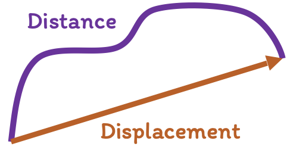

# Introduction

## Motion:

An object is in motion if its position changes with time.

Basic types of motion:

- **Rectilinear or linear motion:** Particle moves in a straight line.
- **Circular or rotatory motion:** Particle moves along a circle.
- **Oscillatory or vibratory motion:** Particle moves back and forth about a fixed point.

This unit deals with **rectilinear motion** or **motion in a straight line**.

## Basic quantities:

The physical quantities can be either **_scalar quantities_** or **_vector quantities_**.

!!! info

    **Scalar quantities** only have a magnitude. E.g.: time, distance, mass, etc.

    **Vector quantities** have both magnitude and direction. E.g.: displacement, velocity, force, etc.

### 1. Distance:

- The total path length travelled by the particle.
- Scalar quantity.
- Unit: $m$

### 2. Displacement:

- Shortest distance between initial point and final point.
- Vector quantity.
- Unit: $m$

???+ info "Distance vs. Displacement"

    { width=200 }

    | Distance                             | Displacement                                        |
    |:-------------------------------------|:----------------------------------------------------|
    | Actual path travelled by the object. | Shortest distance between initial and final points. |
    | Scalar quantity.                     | Vector quantity.                                    |
    | Always positive.                     | Can be positive, negative or zero.                  |
    | $\geq$ displacement                  | $\leq$ distance                                     |

### 3. Speed:

- Distance travelled per unit time.
  $(\text{Speed} = \frac{\text{Disance}}{\text{Time}})$
- Scalar quantity.
- Unit: $m/s$

### 4. Velocity:

- Displacement of particle per unit time.
  $(\text{Velocity} = \frac{\text{Displacement}}{\text{Time}})$
- Vector quantity.
- Unit: $m/s$

!!! tip "At a particular instant, instantaneous speed is equal to instantaneous velocity."

### 5. Acceleration:

- The rate of change of velocity per unit time.
- Vector quantity.
- Unit: $m/s^2$
